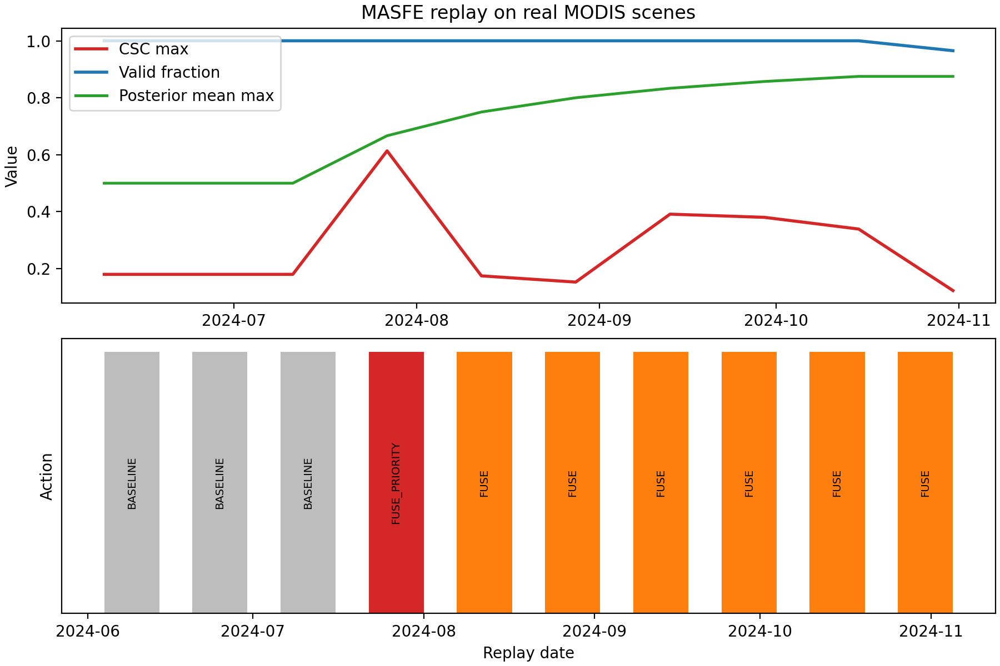

# MASFE

MASFE (Multi-Algorithm Scheduling and Fusion Engine) is a NASA Space-to-Soil submission that treats crop-stress monitoring as an onboard scheduling problem instead of a passive downlink problem. The scheduler is a Bayesian Beta(α, β) posterior driving a finite-horizon MDP over four actions (SKIP, MOD13, FUSE, FUSE_PRIORITY), fusing MOD13A1 EVI, MOD11A1 LST, and MOD09A1-derived NDWI into a three-channel Crop Stress Composite. The repository contains the 100-seed hosted-payload Monte Carlo benchmark, a real-scene MODIS replay over Westlands/Firebaugh (CA, 2024), the five-year rollout economics model, and the final submission paper.

## Verified Headline Metrics (100-seed Monte Carlo)

| vs raw downlink | vs fixed onboard | Recall | FP rate | CPU (peak / seasonal) |
|:---:|:---:|:---:|:---:|:---:|
| **98.9%** downlink reduction<br>**38.3%** energy saving | **79.7%** downlink reduction<br>**26.4%** energy saving | **100.0%** | **1.6%** | **92.5% / 49.2%** |

The Bayesian belief gate keeps about **81%** of passes at cheap 30 m screening, **17%** at FUSE confirmation, and **~2%** at FUSE_PRIORITY alert export in the 100-seed benchmark — that is what drops seasonal compute from 92.5% (always-on fusion baseline) to 49.2% while preserving full disease-event recall. Removing the posterior raises FP from 1.6% to 1.7% and seasonal compute from 49.2% to 76.2%; the posterior is load-bearing as a scheduler.

Priority evidence tiles are compressed onboard via CCSDS 122.0 wavelet coding at ~2.5:1, reducing an 8.4 MB/km² native alert stream to ~3.36 MB/km² delivered.



## Quick Start

Create a fresh environment, install dependencies, and run the synthetic benchmark:

```bash
python3 -m venv .venv
source .venv/bin/activate
pip install -r requirements.txt
python masfe_simulation.py
```

The full benchmark can take several minutes. **Progress:** `tqdm` bars on stderr for Monte Carlo, each policy evaluation, and the ROC sweep; phase banners mark ablation / EVI / CSC / optional “additional ablations”. A plain-text milestone log is always written to **`outputs/benchmark_run.log`** (phase lines and start/finish timestamps), so you can `tail -f outputs/benchmark_run.log` even when the terminal UI hides stderr. Use `python -u masfe_simulation.py` if stdout/stderr appear stuck in a pipe. Set `MASFE_BENCHMARK_QUIET=1` (or legacy `MASFE_MONTE_CARLO_QUIET=1`) to silence tqdm and phase banners on stderr only—the milestone log file is still updated.

After a successful run, the main judge-facing artifacts are refreshed at (headline percentages in the paper and README match `outputs/simulation_metrics.json`—re-run the benchmark after any change to policy or downlink timing):

- `outputs/simulation_metrics.json`
- `outputs/roc.png`
- `outputs/roc_metrics.json`
- `outputs/ablation_metrics.json`
- `outputs/csc_sensitivity.json`

Optional economics refresh:

```bash
python unit_economics.py
```

This repository has been verified in a fresh virtual environment using the dependencies in `requirements.txt` (exact versions are pinned there for reproducible installs).

## Verification and Validation

The repository now includes a layered V&V harness aligned with the TU Delft SVV framing:

- code verification through focused unit tests of the core policy, CSC, replay utilities, and economics math
- calculation/system verification through small seeded pipeline tests for the simulator and replay logic
- offline validation through accepted reference fixtures for the published synthetic metrics, ROC sweep, replay anchors, and economics summary

From a fresh environment, install the project and test dependencies and run the fast suite:

```bash
pip install -r requirements.txt -r requirements-dev.txt
python -m pytest -m "not slow and not validation"
```

Run the full automated suite:

```bash
python -m pytest
```

Run only the offline validation checks:

```bash
python -m pytest -m validation
```

Heavy plot-oriented smoke tests are marked `slow`, and the validation baselines are isolated behind the `validation` marker so routine development runs stay fast and deterministic.

The detailed V&V plan and acceptance criteria live in [docs/verification_validation_plan.md](docs/verification_validation_plan.md).

## Real MODIS Replay

The real-scene replay uses official AppEEARS subsets of `MOD13A1.061` EVI plus QA, `MOD11A1.061` daytime LST plus QC, and `MOD09A1.061` surface reflectance for NDWI over the Westlands / Firebaugh AOI in California. It is framed as scheduler validation on official MODIS scenes, not as a labeled disease benchmark.

Activate the environment:

```bash
source .venv/bin/activate
```

Set Earthdata credentials safely:

```bash
export EARTHDATA_USERNAME='your-username'
read -s EARTHDATA_PASSWORD
export EARTHDATA_PASSWORD
```

Test the AppEEARS login before launching a long replay:

```bash
curl -i -u "$EARTHDATA_USERNAME:$EARTHDATA_PASSWORD" \
  -X POST https://appeears.earthdatacloud.nasa.gov/api/login
```

Run the paper-anchor 2024 replay:

```bash
python real_modis_replay.py \
  --aoi westlands_ca \
  --start 2024-06-01 \
  --end 2024-10-31 \
  --cache-dir data/modis_cache \
  --disable-fallback
```

If the cache or AppEEARS bundle includes `MOD09A1.061`, the replay will derive median clear-sky NDWI over the same composite window and use the full `EVI + LST + NDWI` CSC. If you point the script at an older cached bundle that contains only `MOD13A1` and `MOD11A1`, it will still run and will explicitly fall back to the legacy `EVI + LST` fusion for those steps instead of failing.

Optional second-season extension:

```bash
python real_modis_replay.py \
  --aoi westlands_ca \
  --start 2023-05-01 \
  --end 2023-10-31 \
  --cache-dir data/modis_cache \
  --disable-fallback
```

If you already have an AppEEARS download, reuse the bundle directly instead of authenticating again:

```bash
python real_modis_replay.py \
  --aoi westlands_ca \
  --start 2024-06-01 \
  --end 2024-10-31 \
  --bundle-dir /absolute/path/to/masfe-westlands-2024/
```

```bash
python real_modis_replay.py \
  --aoi westlands_ca \
  --start 2024-06-01 \
  --end 2024-10-31 \
  --bundle-zip /absolute/path/to/masfe-westlands-2024.zip
```

Tracked replay anchor used in the paper:

- `7` valid windows after a `3`-window warmup
- `1` confirmed `FUSE_PRIORITY` window
- first and peak alert date: `2024-07-27`
- mean valid coverage: `0.995`
- tracked cached artifact note: the checked-in 2024 replay rows currently show `EVI/LST fallback` because the local tracked bundle predates the MOD09 extension

## For Judges — 5-Minute Evaluation Path

1. Read the summary and headline metrics above.
2. Open `outputs/roc.png` to see the tunable operating point behind the published threshold.
3. Run `pip install -r requirements.txt && python masfe_simulation.py` to reproduce the synthetic benchmark end to end.
4. Open `outputs/real_modis/westlands_ca_2024-06-01_2024-10-31/replay_summary.png` and `outputs/real_modis/westlands_ca_2024-06-01_2024-10-31/replay_metrics.json` to confirm the real-scene replay artifacts.

## Repository Layout

- `masfe_core.py`: shared CSC computation, Beta-posterior belief model, resolution metadata, and deterministic policy logic.
- `masfe_simulation.py`: 100-seed Monte Carlo benchmark with ROC, ablation, CSC sweep, utilization reporting, and the `EVI + LST + NDWI` synthetic benchmark.
- `real_modis_replay.py`: AppEEARS-backed MODIS replay workflow for the Westlands AOI with MOD09 NDWI support and EVI/LST fallback.
- `unit_economics.py`: five-year SJV-to-global rollout model.
- `outputs/simulation_metrics.json`: paper-facing synthetic benchmark metrics written by `masfe_simulation.py`.
- `outputs/roc.png` and `outputs/roc_metrics.json`: alert-threshold sweep behind the published operating point.
- `outputs/ablation_metrics.json`: matched-recall comparison to the no-belief ablation.
- `outputs/csc_sensitivity.json`: CSC robustness sweep over weights and saturation constants.
- `outputs/unit_economics/unit_economics.json`: detailed low/base/high rollout outputs and break-even summary.
- `outputs/unit_economics/unit_economics_table.tex`: paper-ready LaTeX rendering of the economics table.
- `outputs/real_modis/westlands_ca_2024-06-01_2024-10-31/`: tracked replay artifacts used in the paper.
- `docs/unit_economics.md`: supporting explanation of the rollout model and assumptions.
- `paper/EmilLambert_MASFE.tex`: submission paper source of truth.
- `paper/EmilLambert_MASFE.pdf`: compiled submission PDF.

## Submission alignment (source of truth)

The submitted paper corresponds to commit `002cdc0`. The paper source used for the submission is `paper/EmilLambert_MASFE.tex`.

## License

Released under the MIT License. See `LICENSE`.
