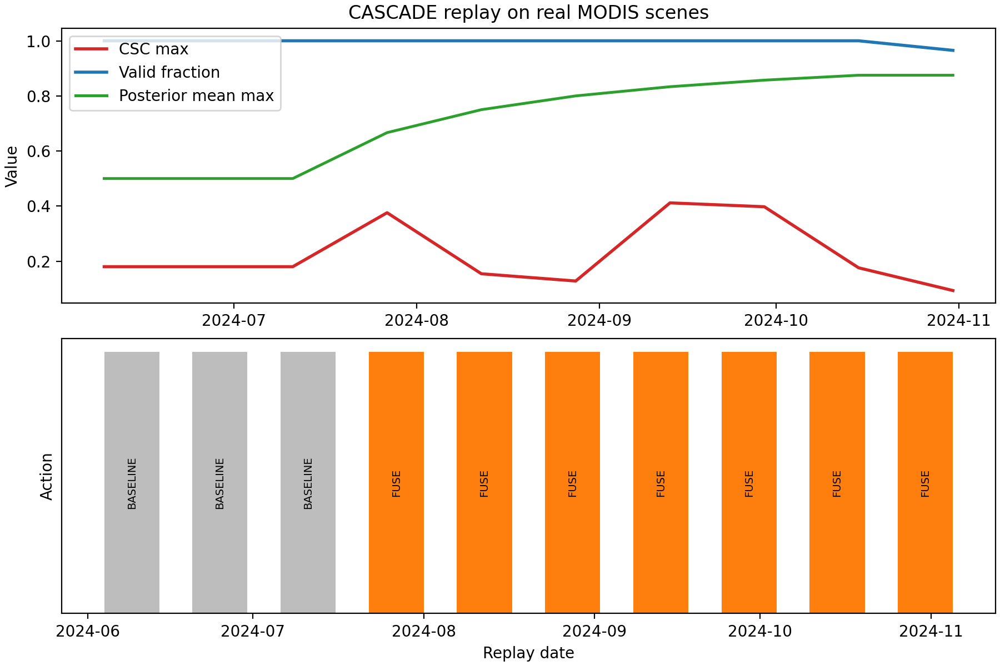

# CASCADE

[](https://github.com/emillambert/CASCADE/actions/workflows/ci.yml)

> CASCADE (An Onboard Crop Anomaly Screening, Confirmation, and Alert Downlink Engine) turns crop-stress monitoring into an **onboard scheduling problem**: a Bayesian belief gate drives a finite-horizon MDP over four actions (**SKIP**, **MOD13**, **FUSE**, **FUSE_PRIORITY**) while fusing MOD13A1 EVI, MOD11A1 LST, and MOD09A1-derived NDWI into a three-channel **Crop Stress Composite (CSC)**.

## Highlights

- **Paper-aligned headline metrics** (100-seed Monte Carlo): **99.1%** downlink reduction, **38.3%** energy saving, **0.6%** FP rate, **92.5% / 49.2%** CPU (peak / seasonal).
- **Real-scene replay anchors** (Westlands/Firebaugh, CA):
  - **2024 quiet season**: peak CSC **`0.412`** vs threshold **`0.615`** → **no** `FUSE_PRIORITY` expected.
  - **2014 D4 drought**: peak CSC **`0.869`**, **`FUSE_PRIORITY` at 6/6 windows** → **`2.1×`** the 2024 peak (**no retuning**).
- **One-command reproducibility**: `make repro-2014`, `make repro-2024`, `make test`, `make figures`.
- **Canonical claims protected by tests**: failing a paper anchor fails CI.



## Overview

CASCADE is a NASA Space-to-Soil submission repository containing:

- **Synthetic benchmark**: a 100-seed Monte Carlo study (ROC sweep + ablations + sensitivity).
- **Real-scene MODIS replay**: AppEEARS-backed replays over the Westlands AOI.
- **Economics model**: a rollout model and accepted baseline fixtures.
- **Paper source**: `paper/EmilLambert_CASCADE.tex` and the compiled PDF.

## Verified headline metrics (paper numbers)

| vs raw downlink | vs fixed onboard | Recall | FP rate | CPU (peak / seasonal) |
|:---:|:---:|:---:|:---:|:---:|
| **99.1%** downlink reduction<br>**38.3%** energy saving | **77.6%** downlink reduction<br>**25.4%** energy saving | **100.0%** | **0.6%** | **92.5% / 49.2%** |

## Installation

Reviewer target: **Python `>=3.10,<3.13`** (fresh virtual environment).

```bash
python3 -m venv .venv
source .venv/bin/activate
python -m pip install -r requirements.txt -r requirements-dev.txt
```

## Usage (fast path)

Run the synthetic benchmark (skips slow “additional ablations” by default):

```bash
python -m cascade.simulate
```

Run the paper-anchor replays:

```bash
python -m cascade.replay --year 2014
python -m cascade.replay --year 2024
```

Run tests:

```bash
python -m pytest -q
```

## Makefile (judge-friendly)

```bash
make test
make repro-2014
make repro-2024
make figures
```

The Makefile uses `.venv/bin/python` when available and otherwise falls back to `python3`; pass `PYTHON=/path/to/python` to override it.

## Real MODIS replay (Earthdata/AppEEARS)

For live downloads, set Earthdata credentials in `.env` or your shell:

```bash
export EARTHDATA_USERNAME='your-username'
read -s EARTHDATA_PASSWORD
export EARTHDATA_PASSWORD
```

Test AppEEARS login:

```bash
curl -i -u "$EARTHDATA_USERNAME:$EARTHDATA_PASSWORD" \
  -X POST https://appeears.earthdatacloud.nasa.gov/api/login
```

Run the replay workflow directly:

```bash
python real_modis_replay.py --help
```

## Repository map

- **Package code**: `src/cascade/`
- **Replay**: `src/cascade/replay/modis.py`
- **Benchmark**: `src/cascade/simulation.py`
- **Tracked outputs**: `artifacts/`
- **Transient outputs**: `build/`
- **Paper**: `paper/EmilLambert_CASCADE.tex` (source of truth)

More detail: [docs/repo_structure.md](docs/repo_structure.md)

## Concise docs

- [Repository structure](docs/repo_structure.md)
- [Reproducibility](docs/reproducibility.md)
- [Validation](docs/validation.md)
- [Replay anchors](docs/replay_anchors.md)
- [Unit economics](docs/unit_economics.md)

## For judges — 5-minute evaluation path

1. Read **Highlights** + the **metrics table** above.
2. Open `artifacts/benchmark/roc.png`.
3. Run `make repro-2014` or `make repro-2024` (or `python -m cascade.simulate`).
4. Open the tracked replay metrics under `artifacts/replay/` or read [docs/replay_anchors.md](docs/replay_anchors.md).

## Citation

If you use this repository, please cite it via `CITATION.cff`.

## License

Released under the **MIT License**. See `LICENSE`.
